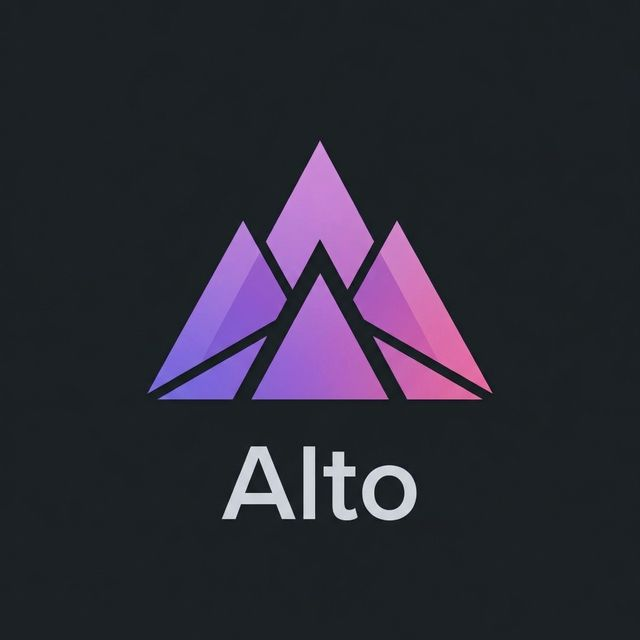

# Alto - AI Powered System Cleaner & Optimizer



<div align="center">

[](https://github.com/Adiuk24/alto-AI_mac_cleaner/releases/latest)
[](https://github.com/Adiuk24/alto-AI_mac_cleaner/releases/latest)
[](https://github.com/Adiuk24/alto-AI_mac_cleaner/releases/latest)

</div>

**Alto** is a professional, high-performance system cleaning and optimization tool built with **Tauri**, **React**, and **Rust**. The **v2.1.0 "Agentic Edition"** introduces a revolutionary AI-first approach to system maintenance, combining a premium UI with deep system awareness via **Model Context Protocol (MCP)**.

---

## 🚀 Key Features (v2.1.0 "Agentic Edition")

*   **🧠 Agentic AI Assistant**: A truly proactive assistant that monitors your Mac/PC in real-time. It doesn't just chat; it executes real tasks and reports actual results.
*   **🛡️ MCP Safety Layer**: Implements a strict Model Context Protocol safety gate. Every deletion is indexed and categorized before being presented for your two-step confirmation.
*   **🔔 Live System Monitoring**: Background watcher notifies you proactively when apps are installed or suspicious files are downloaded.
*   **🧹 System Junk**: Deep scan and removal of cache, logs, and temporary files (Cross-platform support).
*   **⚡ Speed Optimization**: Intelligent DNS flushing and RAM freeing.
*   **🔍 Space Lens**: A powerful visual explorer for your disk usage.
*   **📦 Uninstaller**: Cleanly remove applications and their leftover "ghost" files.
*   **🛡️ Malware Scan**: Native heuristics for both macOS Launch Agents and Windows Startup threats.
*   **📧 Mail Cleaner**: Reclaim space occupied by massive local mail attachments.

## 🛠️ Technology Stack

*   **Frontend**: React 19, TypeScript, Framer Motion (Premium Animations)
*   **Backend**: Rust (Tauri v2 Core)
*   **Safety**: MCP (Model Context Protocol) Implementation
*   **Build Tool**: Vite + Esbuild Optimized

## 🧠 MCP & Privacy

Alto is designed with privacy and safety at its core.
- **Local Context**: All indexing and context data stays at `~/.alto/context.json`.
- **Safety Gate**: Alto uses a dedicated file indexer that blocks deletion of system-critical folders (`/System`, `C:\Windows`, etc.) and user data (`Documents`, `Desktop`).
- **Offline AI**: Supports WebLLM for entirely local inference — your data never leaves your machine.

## 📥 Installation

### For Users
1.  Go to the [Releases](https://github.com/Adiuk24/alto-AI_mac_cleaner/releases) page.
2.  Download the latest installer:
    - **macOS**: `.dmg`
    - **Windows**: `.msi` or `.exe`
3.  Launch Alto and follow the setup.

### For Developers

**Setup:**
1.  Clone the repository: `git clone https://github.com/Adiuk24/alto-AI_mac_cleaner.git`
2.  Install dependencies: `npm install`
3.  Run in dev mode: `npm run tauri dev`
4.  Build: `npm run tauri build`

## 🛠️ Troubleshooting (macOS)

If you see "App is damaged and can't be opened" (Gatekeeper):
1. Move **Alto** to `/Applications`.
2. Run in Terminal:
   ```bash
   sudo /usr/bin/xattr -rd com.apple.quarantine /Applications/Alto.app
   ```

## 🤝 Development Team & Credits

Alto is a collaborative effort between human vision and mathematical intelligence.

### Core Team
*   **Arif Adito** ([@Adiuk24](https://github.com/Adiuk24))
    *   *Role*: Lead Architect, System Designer & Product Vision.
    *   *Contribution*: Designed the core system architecture, UX/UI aesthetic, and cross-platform logic.
*   **Antigravity (AI)**
    *   *Role*: Core AI Developer.
    *   *Contribution*: Implemented the Agentic Chat flow, MCP safety layers, and high-performance Rust modules.

### Special Thanks
*   **Adioris ltd**: For supporting the project's development and holding the vision for Alto's commercial-grade quality.
*   **The Open Source Community**: Massive thanks to the teams behind [Tauri](https://tauri.app), [Rust](https://www.rust-lang.org), [React](https://react.dev), and [Lucide](https://lucide.dev) for providing the building blocks of this application.

## 📄 License

Distributed under the MIT License. See `LICENSE` for more information.

Copyright © 2026 **Adioris ltd**. All rights reserved.
