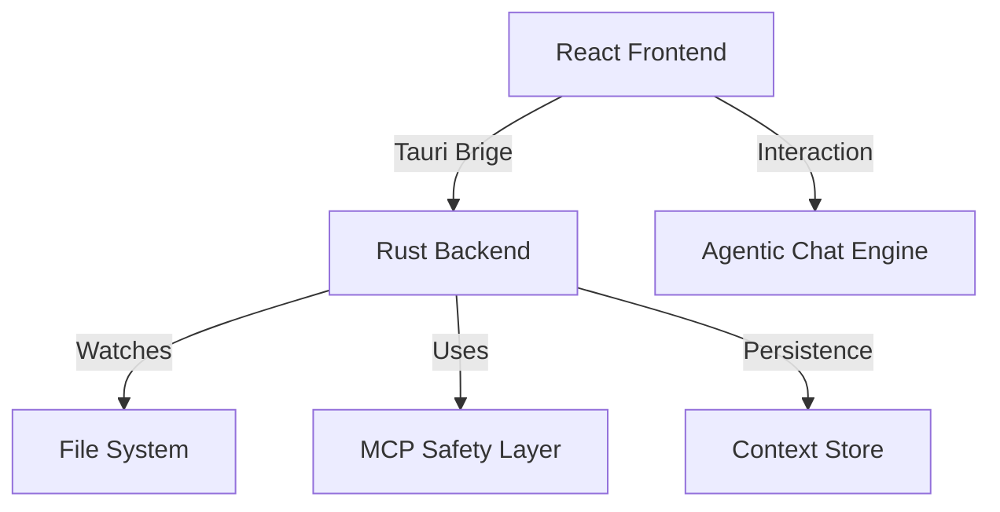

# System Architecture 🏗️

Alto is built on a hybrid architecture that combines the rendering speed of **React** with the system-level safety and performance of **Rust**.

---

## 🏗️ High-Level Overview

## 🧠 Agentic Flow (v2.1.0)
The heart of Alto is its Agentic interaction model. Instead of clicking buttons, the user can express intent via chat.

1.  **Intent Parsing**: The AI analyzes the user's request (e.g., "Clean my Mac").
2.  **Tool Selection**: The AI selects the appropriate Rust scanners (Junk, Malware, etc.).
3.  **Real-Time Execution**: The Rust backend performs the scan and returns structured results.
4.  **Mathematical Summary**: The AI receives the *actual data* (paths, byte sizes) and provides an accurate, non-hallucinated summary.

## 🛡️ MCP (Model Context Protocol) Safety Layer
To ensure the AI never deletes anything critical, we implemented a custom MCP layer:

-   **Indexing**: Every file flagged for deletion is first indexed by the `mcp/file_index.rs` module.
-   **Categorization**: Files are categorized as `Cache`, `Log`, `UserData`, or `SystemCritical`.
-   **Confirmation Gate**: Any file marked for deletion *must* pass the safety index. If it is `SystemCritical` or `UserData`, the backend will refuse to delete it, even if the AI requests it.

## 💾 Context Store
All system events and history are persisted locally in `~/.alto/context.json`.
-   **SystemEvents**: Tracks app installs and suspicious downloads.
-   **DeletionHistory**: Stores stats on how much space was freed and when.

## 💻 Tech Stack Deep Dive
-   **Tauri v2**: Uses the system's native WebView for the UI, keeping the binary size tiny.
-   **Framer Motion**: Handles premium micro-animations and layout transitions.
-   **WebLLM**: Enables entirely local AI execution with zero data leakage.

---
*For questions regarding the architecture, please open an issue or contact the lead architect.*
